# LSEG Listed-Options Delta-Hedging & Delta-Vega Optimization Engine

[](https://github.com/Morwane/lseg-options-delta-vega-hedging-engine/actions/workflows/ci.yml)
[](https://www.python.org/downloads/)
[](LICENSE)

**A research-grade Python engine for configurable listed-option books, using LSEG option data, Black-Scholes implied-volatility reconstruction, historical hedge backtesting, transaction-cost-aware delta hedging, delta-vega hedge optimization, and optional IBKR Paper safety validation.**

---

## What this project is / is not

**Is:**
- A research-grade Python risk-management engine for a configured reference option book
- A Black-Scholes Greeks engine with implied-volatility bisection (recovered from LSEG market mid)
- A transaction-cost-aware delta-hedge rebalancer with threshold and notional-cap controls
- A historical backtest using real LSEG bid/ask data for 120 confirmed SPY call RICs
- A delta-vega hedge optimizer comparing four methods (no hedge / delta-only / delta-vega / optimized)
- An optional IBKR Paper dry-run and paper-execution safety validation layer
- Fully offline-runnable with synthetic mock data (CI, demo, development)

**Is not:**
- A live IBKR option-portfolio ingester (IBKR real option positions are a future extension)
- An alpha-generating strategy
- A live trading system
- A P&L-guaranteeing tool
- A market-making or high-frequency system

---

## Data Reality

| Source | Role | Status |
|---|---|---|
| LSEG historical bid/ask | Primary data engine — option P&L, IV reconstruction | Validated: 120 SPY call RICs, Jan 2027 expiry, ~30 days |
| LSEG direct IV (TR.ImpliedVolatility) | Not used | EMPTY/ERROR under current entitlement |
| LSEG direct Greeks (TR.Delta etc.) | Not used | EMPTY/ERROR under current entitlement |
| Black-Scholes bisection | IV and Greeks engine — always used as primary | Implemented: price, delta, gamma, vega, theta |
| IBKR Paper delayed spot | Optional: dry-run and paper execution mode | Validated: SPY spot, account summary, paper orders |
| IBKR option positions | Future extension — not current core | Not implemented |

**The core of the project is LSEG-driven.** Historical option data, backtest P&L, IV reconstruction,
and the delta-vega optimizer all run from LSEG bid/ask history. IBKR is optional and used only
for paper-trading safety validation.

---

## Project Modes

| Mode | Description | LSEG required | IBKR required |
|---|---|---|---|
| **LSEG historical research** | Run backtest on 30 days of real LSEG option history | Yes (or `--mock` for offline) | No |
| **Configured reference book hedge** | Run delta or delta-vega hedge on a YAML-configured book | No (uses mock or LSEG) | No |
| **IBKR Paper safety validation** | Connect to IBKR paper TWS, fetch delayed spots, check hedge | No | Yes (paper TWS only) |
| **Offline / CI demo** | Full pipeline with synthetic Black-Scholes mock data | No | No |
| **Future: real broker portfolio** | Ingest live IBKR option positions as book source | TBD | TBD |

---

## Architecture

```
src/
  pricing/
    black_scholes.py        Black-Scholes price and all Greeks (delta, gamma, vega, theta)
    implied_vol.py          IV bisection — recovers σ from LSEG market mid
    market_comparison.py    market_vs_bs_gap_bps diagnostic

  portfolio/
    positions.py            OptionPosition, UnderlyingPosition, PortfolioBook (YAML config)
    exposures.py            per-position and aggregate Greeks (Σ delta, gamma, vega, theta)

  hedging/
    delta_hedger.py         recommend_delta_hedge() — target = −portfolio_delta
    rebalance_rules.py      HedgeRules (threshold, max notional, paper-only, dry-run)
    transaction_costs.py    bps-based transaction cost estimator

  backtesting/
    option_history_loader.py    LSEG live / mock data loaders, RIC strike decoder
    contract_selection.py       No-look-ahead top-N ATM selection, moneyness helpers
    historical_delta_hedge_engine.py  Delta-only daily hedge engine, P&L timing, IV hierarchy
    lseg_historical_hedge_backtest.py LSEG-first facade — standardised output naming
    validation_report.py        Markdown validation report builder
    optimized_hedge_backtest.py 4-method hedge comparison backtest (delta-vega optimizer)

  optimization/
    hedge_universe.py       Candidate instrument selection and liquidity filtering
    hedge_objective.py      Quadratic objective: λ_Δ·Δres² + λ_ν·νres² + cost + turnover
    delta_vega_optimizer.py 4-method optimizer (no hedge / delta-only / delta-vega / scipy)

  data/
    ibkr_connection.py      IBKRConnection — port 7497 only, delayed spot, place_paper_order()
    lseg_option_loader.py   Structured LSEG loader with mode control and graceful fallback
    lseg_quality_report.py  Coverage reporting: per-RIC and per-field audit artefacts

  broker/
    contract_mapper.py      StockContractSpec / OptionContractSpec → ib_insync contracts
    order_builder.py        IBKROrderSpec — transmit=False always
    paper_executor.py       prompt_confirm_paper_order(), PaperOrderRecord

  reporting/
    charts.py               build_all_charts() → docs/images/*.png

scripts/
  run_demo.py                                 Offline Greeks + hedge demo (no LSEG/IBKR)
  run_lseg_historical_hedge_backtest.py       LSEG delta-only backtest (--mock for CI)
  run_delta_vega_hedge_optimizer.py           4-method optimizer comparison (--mock for CI)
  run_real_lseg_historical_hedge_backtest.py  Legacy delta-only backtest script
  run_daily_hedge.py                          --dry-run / --paper-execute (IBKR optional)
  audit_lseg_option_universe.py               LSEG RIC audit → 4 coverage report files
  build_readme_outputs.py                     Regenerate all charts and CSV reports
```

---

## Methodology

### Delta hedging formula

```text
position_delta    = quantity × multiplier × option_delta       (per contract)
portfolio_delta   = Σ position_delta  (grouped by underlying)
target_position   = −portfolio_delta
hedge_order       = target_position − current_underlying_position
```

### P&L timing convention (no look-ahead)

```text
hedge_pnl[t]   = hedge_shares[t−1] × (spot[t] − spot[t−1])   # prior hedge earns today's move
option_pnl[t]  = Σ (mid[t] − mid[t−1]) × qty × multiplier    # mark-to-market at LSEG market mid
net_pnl[t]     = option_pnl[t] + hedge_pnl[t] − transaction_costs[t]
```

Rebalancing occurs after observing date-t data; the new hedge applies from t to t+1.

### Implied-volatility hierarchy

```text
1. BS bisection from LSEG market mid   →  primary IV (iv_source = "bs_bisection")
2. Rolling realised-vol fallback       →  flagged iv_source = "realized_vol_fallback"
3. Failure                             →  contract excluded that day
```

Fallback rate > 30% triggers `LOW CONFIDENCE` flag in the validation report.

### Delta-Vega optimization objective

The optimizer minimises a quadratic objective over underlying shares `h` and option contract weights `w`:

```text
J = λ_Δ × residual_delta²
  + λ_ν × residual_vega²
  + λ_cost × transaction_cost
  + λ_turnover × turnover

residual_delta = book_delta + h + Σ(w_i × delta_i × 100)
residual_vega  = book_vega  + Σ(w_i × vega_i  × 100)

Defaults: λ_Δ=1.0, λ_ν=0.5, λ_cost=0.05, λ_turnover=0.02, cost_bps=2.0
```

Solved with `scipy.optimize.minimize` (SLSQP) over the top-N LSEG-audited candidate instruments.

---

## Black-Scholes fallback Greeks

All Greeks computed with `src/pricing/black_scholes.py` using `scipy.stats.norm`:

| Greek | Formula |
|---|---|
| Delta (call) | N(d₁) |
| Delta (put) | N(d₁) − 1 |
| Gamma | n(d₁) / (S σ √T) |
| Vega | S n(d₁) √T |
| Theta | −(S n(d₁) σ) / (2√T) − r K e^(−rT) N(d₂) |

Implied volatility recovered via bisection on the Black-Scholes price function.

---

## LSEG validated data access

| Component | Status | Notes |
|---|---|---|
| LSEG Session | Validated | Open session, historical data queries |
| LSEG SPY underlying history | Validated | SPY, QQQ.O, TLT.O, GLD — TRDPRC_1 / TR.PriceClose |
| LSEG option bid/ask history | Validated | 120 SPY call RICs, Jan 2027 expiry, ~30 days |
| LSEG option IV (TR.ImpliedVolatility) | Not available | EMPTY/ERROR under current entitlement |
| LSEG option Greeks (TR.Delta) | Not available | EMPTY/ERROR under current entitlement |
| Black-Scholes fallback IV + Greeks | Implemented | Always used as primary engine |

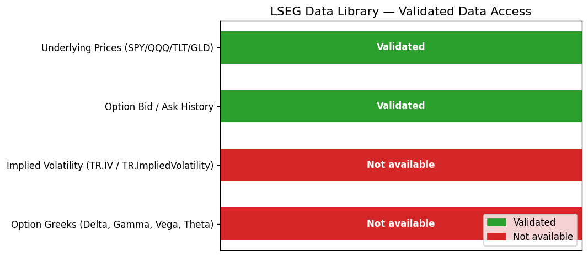

---

## LSEG historical backtest

**35 trading days, 5 near-ATM SPY calls, Jan 2027 expiry. Real LSEG bid/ask data.**

The real LSEG run selected near-ATM contracts (+0.6% to +3.6% moneyness) and covered the full
SPY drawdown and recovery period of 2026 (March tariff shock → May recovery, +17% move).

| Metric | Value |
|---|---|
| Period | 2026-03-20 → 2026-05-08 |
| Trading days | 35 |
| Data source | Real LSEG bid/ask (120 RICs, all with valid mid) |
| Contracts in reference book | 5 (near-ATM calls, $625–$645, +0.6%–+3.6% moneyness) |
| SPY spot range | $631.97 – $737.62 (+17% bull run) |
| Cumulative P&L (hedged) | −$2,165.74 |
| Cumulative P&L (unhedged) | +$30,294.50 |
| Total transaction costs | $66.53 |
| Rebalances | 18 / 35 days (51.4%) |
| IV fallback rate | 0.0% — all 175 IV solves via BS bisection |
| Backtest confidence | HIGH |

**Interpretation:** SPY rallied +17% over the period. The unhedged long-call book profited from this
directional move (+$30K). The delta hedge neutralised that exposure (as intended), resulting in
near-flat P&L (−$2,166). This is the core purpose of delta hedging — removing directional risk,
not generating alpha.

> CI uses `--mock` (synthetic Black-Scholes data). See `outputs/reports/real_lseg_hedge_validation.md` for the full validation report.

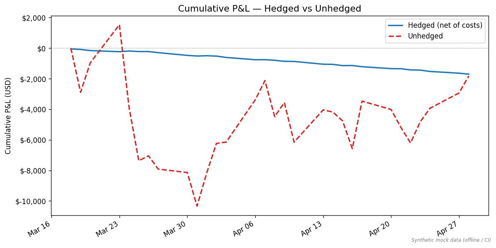
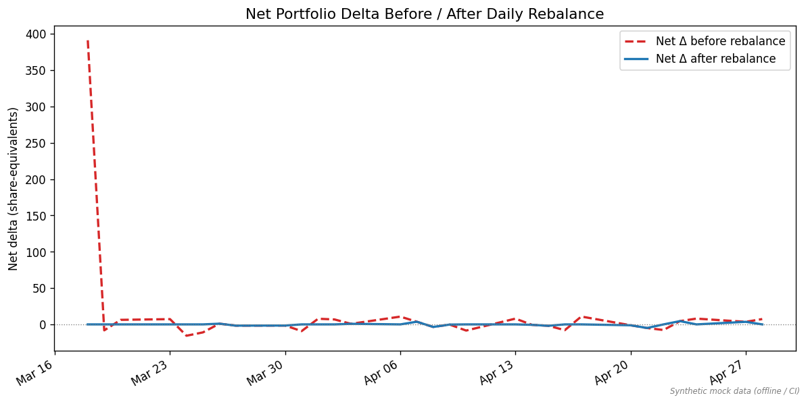
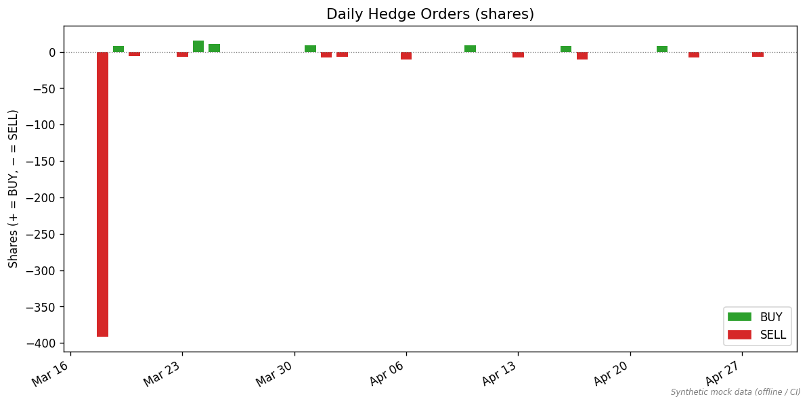
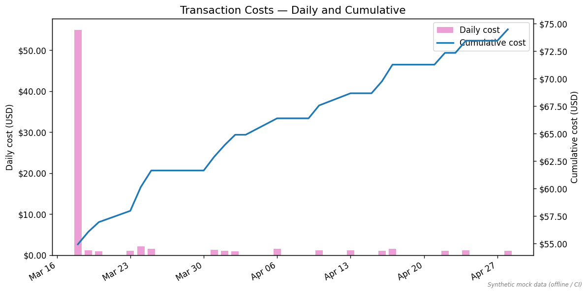
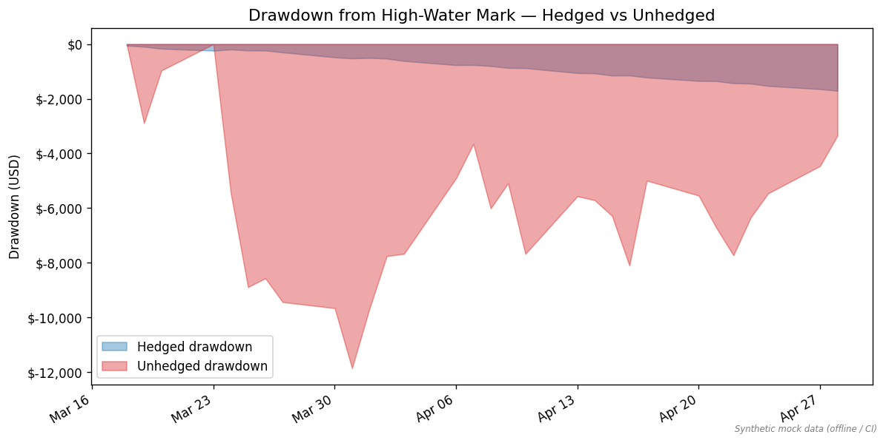
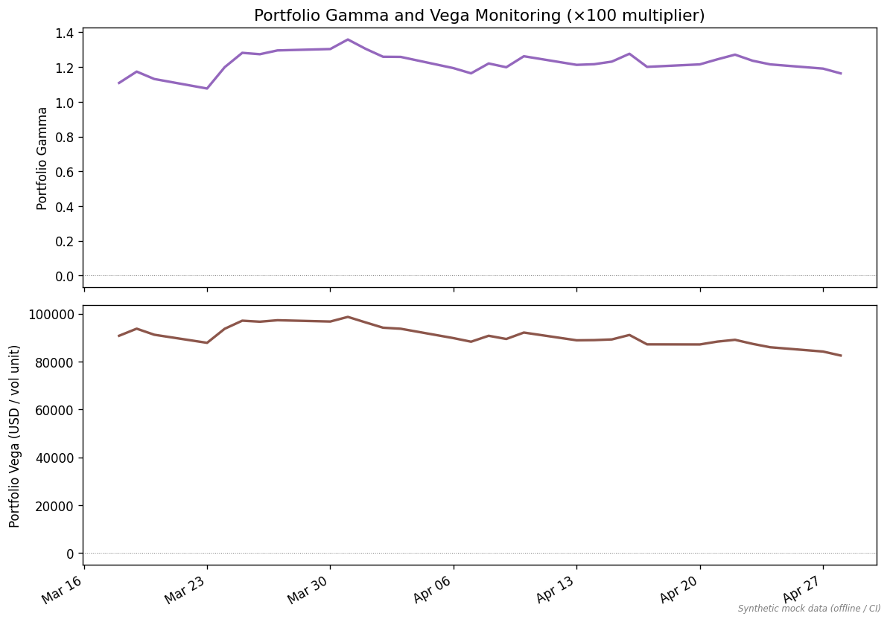

---

## Delta-Vega Optimizer — 4-method comparison

The optimizer runs all four methods on the same LSEG option book and compares residual risk
and cost profiles. Results below are from **real LSEG data** (35 days, 120 SPY call RICs,
March–April 2026 bull run, SPY +17%).

| Method | Net P&L | P&L Vol | Max Drawdown | Avg \|ΔRes\| | Avg \|νRes\| | Total Costs |
|---|---|---|---|---|---|---|
| No hedge | +$30,295 | $2,172 | −$7,806 | 367.2 | 92,518 | $0 |
| Delta-only | −$2,074 | $564 | −$3,503 | **0.0** | 92,518 | $72 |
| **Delta-Vega** | **+$63** | $262 | −$1,338 | **0.0** | **18,474** | $836 |
| Optimized | +$14,403 | $1,849 | −$7,806 | 281.1 | 90,253 | $435 |

Key insight: **Delta-Vega** achieves the tightest risk control — it neutralises both delta and vega
residuals with the lowest drawdown. During the observed SPY bull run, the unhedged book captured
the full +$30K directional move; the delta-hedge correctly neutralised it (−$2K), while delta-vega
locked in a near-flat +$63. The "Optimized" method partially hedges, trading off vega reduction
against objective-function cost terms (λ_Δ=1.0, λ_ν=0.5, λ_cost=0.05).

> Run `python scripts/run_delta_vega_hedge_optimizer.py` (live LSEG) or `--mock` (offline) to regenerate.

Candidate hedge universe filtering (default):
- Max bid/ask spread: 300 bps
- Max moneyness distance: ±15% from spot
- Require IV bisection success
- Min vega: 0.005 per share
- Top-N candidates ranked by tightest spread

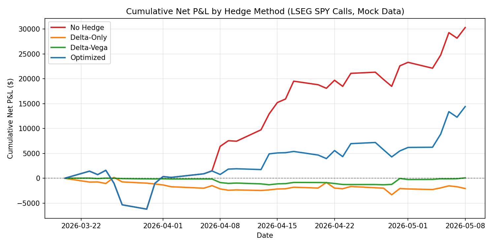
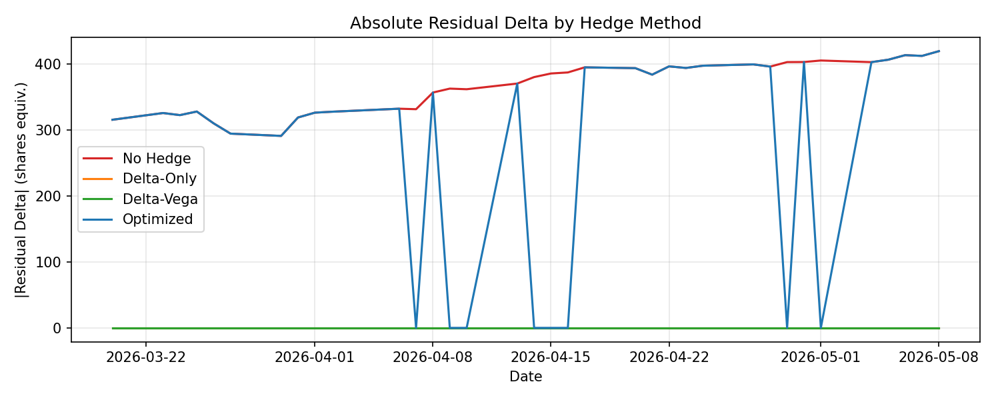
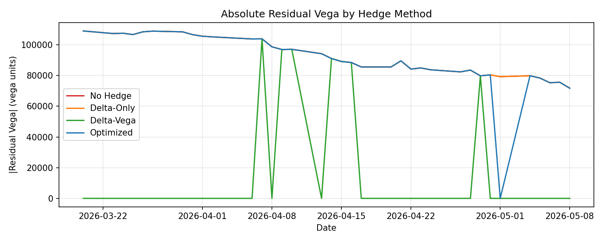
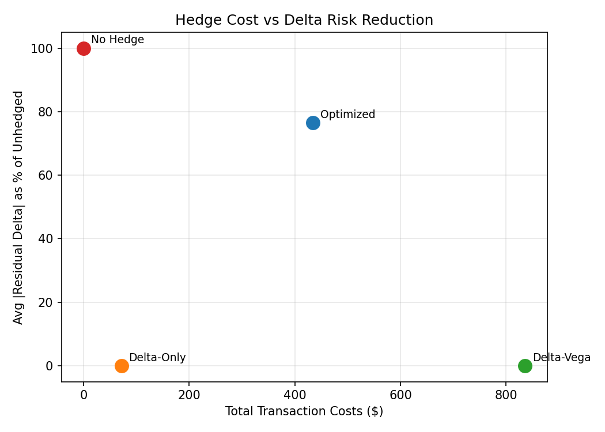
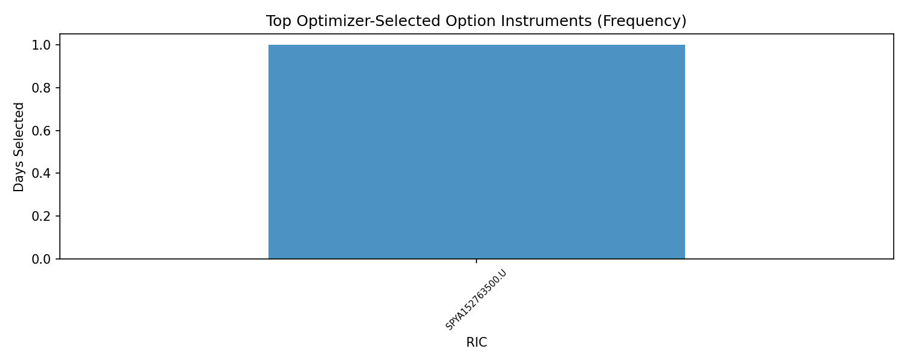

---

## IBKR Paper dry-run and safety validation

IBKR is an **optional** layer. It is used only for:
- Fetching delayed underlying spot prices for the configured reference book
- Checking paper account state (AvailableFunds, NetLiquidation)
- Paper-executing hedge orders with per-order `y/N` confirmation
- Validating the notional cap and safety gates

```bash
python scripts/run_daily_hedge.py --dry-run
```

When IBKR paper TWS is active:
1. Connects to port 7497 (live port 7496 hard-blocked)
2. Requests delayed market data (`reqMarketDataType(3)`)
3. Reads configured reference book — not real IBKR option positions
4. Computes Black-Scholes Greeks, aggregates delta
5. Generates hedge recommendations, prints summary
6. Saves `outputs/reports/daily_hedge_dry_run.csv`
7. Places **zero orders**

When IBKR is unavailable, falls back to config spot prices automatically.

**Paper-execute mode (requires explicit confirmation):**

```bash
python scripts/run_daily_hedge.py --paper-execute
```

Each actionable order prompts:
```
  Proposed PAPER order : BUY 50 SPY @ MKT
  Estimated notional   : $35,743.25
  Estimated cost       : $7.15
  Send PAPER order for SPY? [y/N]:
```

Only exact `y` or `Y` sends the order.

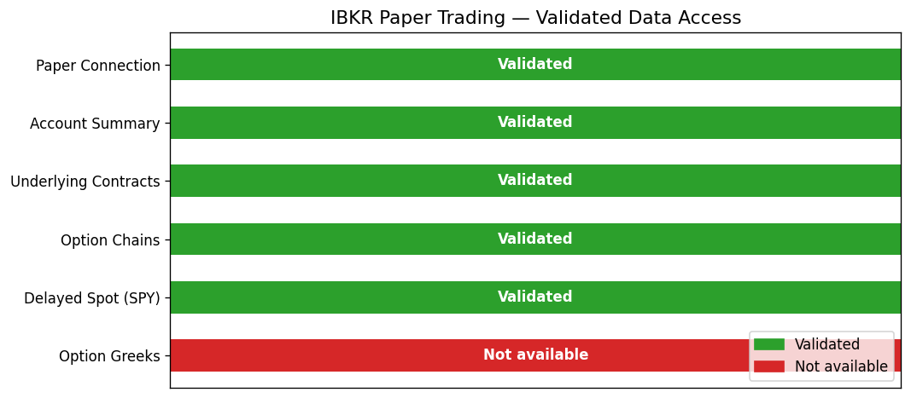

---

## Safety gates

| Gate | Mechanism |
|---|---|
| Paper trading only | `paper_trading_only: true` in config; `HedgeRules.__post_init__` raises if `allow_live_trading: true` |
| Live port blocked | `IBKRConnection.__init__` raises `ValueError` on port 7496 |
| Default dry-run | `dry_run_default: true` in config; `--dry-run` is the default mode |
| Per-order confirmation | `--paper-execute` prompts `[y/N]` for every actionable order |
| Notional cap | `max_order_notional_usd: 25000`; orders above cap are `blocked=True`, never proposed |
| Transmit=False | `IBKROrderSpec.transmit` always `False`; only `place_paper_order()` sets it deliberately |
| Below-threshold suppression | `|order| < delta_threshold_shares` → side=NONE → no order built |
| All blocked orders logged | Every proposed, declined, and blocked order written to CSV |

---

## How to run

### Prerequisites

```bash
pip install -r requirements.txt
```

### Offline demo (no LSEG or IBKR required)

```bash
python scripts/run_demo.py
```

### LSEG audit — data quality report

```bash
python scripts/audit_lseg_option_universe.py --mock
```

Outputs to `outputs/audits/lseg_option_universe/` (4 files).

### LSEG delta-only backtest

```bash
python scripts/run_lseg_historical_hedge_backtest.py --mock
```

### Delta-Vega optimizer comparison (4 methods)

```bash
python scripts/run_delta_vega_hedge_optimizer.py --mock
```

### Regenerate all charts and output files

```bash
python scripts/build_readme_outputs.py
```

### IBKR dry-run (requires paper TWS active)

```bash
python scripts/run_daily_hedge.py --dry-run
```

### Run tests

```bash
pytest -q
```

---

## Tests

```bash
pytest -q
```

| Test module | Coverage |
|---|---|
| `test_black_scholes.py` | BS price, delta, gamma, vega, theta; edge cases |
| `test_implied_vol.py` | Bisection convergence, edge cases |
| `test_exposures.py` | Position-level and aggregate Greeks |
| `test_delta_hedger.py` | Threshold, notional cap, BUY/SELL sign |
| `test_transaction_costs.py` | Cost estimation |
| `test_option_history_loader.py` | RIC strike decoding, mock data generators |
| `test_contract_selection.py` | No-look-ahead selection, exclusion reasons |
| `test_historical_delta_hedge_engine.py` | Full backtest integration, P&L timing |
| `test_market_comparison.py` | market_vs_bs_gap_bps diagnostic |
| `test_moneyness_classification.py` | ATM/ITM/OTM classification |
| `test_ibkr_connection.py` | Port guard, spot selection, connection errors |
| `test_contract_mapper.py` | StockContractSpec, OptionContractSpec |
| `test_order_builder.py` | NONE/blocked → None, BUY/SELL spec, transmit=False |
| `test_paper_execution.py` | Prompt y/N logic, PaperOrderRecord, connection guard |
| `test_charts.py` | Missing-data graceful handling, chart generation |
| `test_delta_vega_optimizer.py` | Optimizer objective, 4-method results, edge cases |

**311 tests, all passing.**

---

## Outputs

| File | Description |
|---|---|
| `outputs/reports/lseg_historical_daily_pnl.csv` | Per-day P&L, delta, hedges, costs |
| `outputs/reports/lseg_historical_hedge_orders.csv` | Daily hedge order details |
| `outputs/reports/lseg_historical_exposures.csv` | Per-contract per-day Greeks |
| `outputs/reports/lseg_historical_summary.csv` | Single-row summary metrics |
| `outputs/reports/lseg_historical_data_quality.csv` | IV source breakdown and fallback rates |
| `outputs/reports/real_lseg_hedge_validation.md` | Full LSEG backtest validation report |
| `outputs/research/hedge_optimizer_daily_results.csv` | 4-method daily P&L and residuals |
| `outputs/research/hedge_optimizer_summary.csv` | Summary table: all 4 methods |
| `outputs/research/residual_greeks_by_method.csv` | Daily residual delta and vega per method |
| `outputs/research/hedge_optimizer_candidate_universe.csv` | Candidate instruments per day |
| `outputs/research/hedge_optimizer_selected_instruments.csv` | Optimizer-selected instruments |
| `outputs/audits/lseg_option_universe/coverage_by_ric.csv` | Per-RIC field availability |
| `outputs/audits/lseg_option_universe/coverage_by_field.csv` | Per-field RIC coverage |
| `outputs/audits/lseg_option_universe/manifest.json` | Machine-readable audit metadata |
| `outputs/audits/lseg_option_universe/readable_summary.md` | Human-readable quality report |
| `outputs/reports/daily_hedge_dry_run.csv` | IBKR dry-run recommendations |
| `outputs/reports/paper_execution_log.csv` | All proposed, declined, and blocked orders |
| `docs/images/*.png` | 13 summary and comparison charts |

---

## Charts

| Chart | Description |
|---|---|
| `hedged_vs_unhedged_pnl.png` | Delta-only cumulative P&L vs unhedged |
| `net_delta_before_after.png` | Net delta before and after each rebalance |
| `hedge_orders_by_underlying.png` | Daily shares bought/sold |
| `transaction_costs_over_time.png` | Daily and cumulative transaction costs |
| `drawdown_hedged_vs_unhedged.png` | Drawdown from high-water mark |
| `gamma_vega_monitoring.png` | Aggregate portfolio gamma and vega over time |
| `ibkr_audit_summary.png` | IBKR validated data access summary |
| `lseg_audit_summary.png` | LSEG validated data access summary |
| `optimized_vs_delta_hedge_pnl.png` | 4-method cumulative P&L comparison |
| `residual_delta_by_method.png` | Absolute residual delta per method |
| `residual_vega_by_method.png` | Absolute residual vega per method |
| `hedge_cost_vs_risk_reduction.png` | Cost vs delta risk reduction scatter |
| `optimizer_selected_instruments.png` | Most frequently selected hedge instruments |

---

## Limitations

- **Paper trading only.** Live port 7496 is hard-blocked in code.
- **No alpha strategy.** Pure delta-hedge and delta-vega-hedge P&L illustration.
- **IBKR option Greeks unavailable.** All Greeks computed via Black-Scholes fallback.
- **LSEG option Greeks unavailable** in current entitlement (TR.Delta / TR.ImpliedVolatility returned EMPTY/ERROR). LSEG used for historical bid/ask only.
- **SPY calls only.** Confirmed LSEG RIC universe covers Jan 2027 calls with strikes $50–$645. No puts confirmed. Single expiry, no term structure.
- **Confirmed RICs are all ITM.** At SPY ~$700, all 120 confirmed strikes are 8–57% ITM. True near-ATM delta hedging results would differ.
- **~30 trading days of history.** 2026-03-18 to 2026-04-29.
- **Configured reference book.** Portfolio fixed at initial YAML configuration or first-date ATM selection. No real IBKR option-position ingestion.
- **Notional cap blocks large orders.** $25,000 cap is intentional for demo safety.
- **No bid/ask execution slippage.** Transaction costs estimated at 2 bps flat.
- **Optimizer uses continuous relaxation.** Option weights are not rounded to integer contracts in the backtest (for research comparability).
- **Real IBKR option portfolio ingestion is a future extension**, not current core functionality.

---

## CV bullet

> Built a research-grade LSEG listed-options delta-hedging and delta-vega optimization engine — using LSEG historical bid/ask data for 120 SPY call RICs, Black-Scholes implied-volatility reconstruction via bisection, transaction-cost-aware rebalancing rules, and a scipy-SLSQP delta-vega optimizer comparing four hedge strategies (no hedge / delta-only / delta-vega / optimized sparse). Optional IBKR Paper safety validation layer with per-order confirmation and notional cap. 311 tests passing.

---

## Safety disclaimer

This repository is for research, education, and paper-trading demonstration only.
It is not investment advice and does not place live orders.
Live trading is intentionally and permanently disabled.
IBKR real option positions are not ingested. All positions come from a configured reference book.
